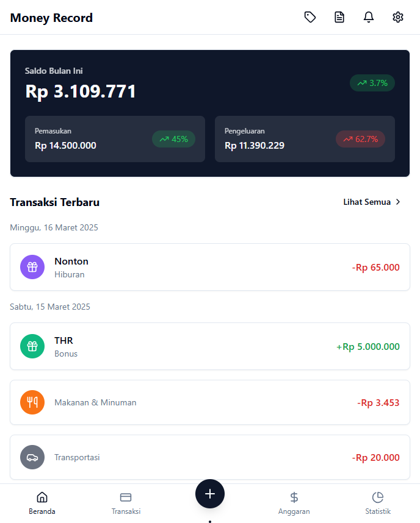
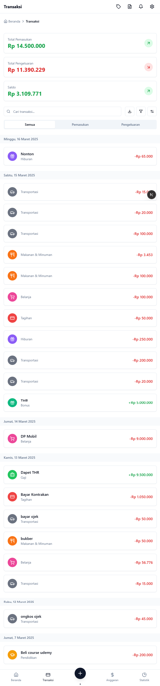
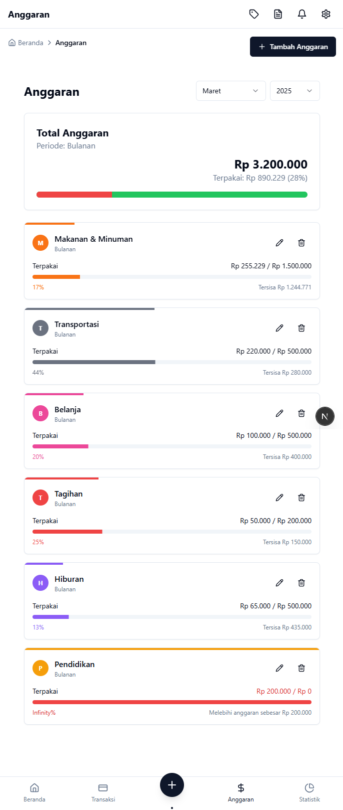
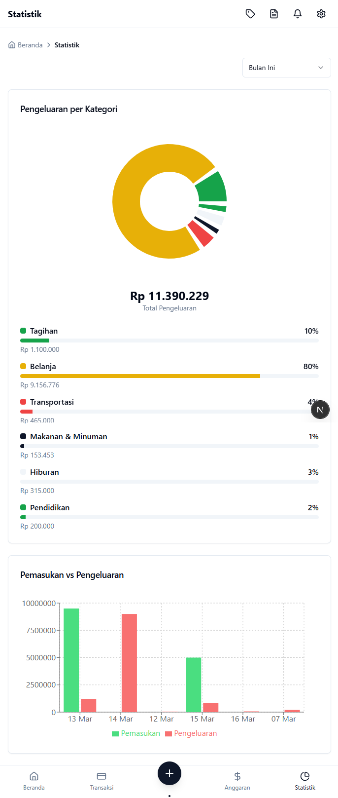

# 💰 Money Record

A modern and intuitive personal finance management API built with Laravel and Next.js. Track expenses, manage budgets, and gain insights into your spending habits.

## 🌟 Features

- **💳 Transaction Management**
  - Track income and expenses
  - Categorize transactions
  - Add descriptions and dates
  - View transaction history

- **📊 Budget Planning**
  - Set monthly budgets by category
  - Track spending against budgets
  - Get real-time budget alerts
  - View budget performance

- **📱 Modern UI/UX**
  - Responsive design
  - Dark/Light mode
  - Mobile-first approach
  - Interactive charts and graphs

- **🔒 Security**
  - JWT Authentication
  - Google OAuth integration
  - Protected API endpoints
  - Secure user data handling

## 🛠️ Tech Stack

### Backend
- Laravel 10.x
- MySQL
- Sanctum Authentication
- Redis Cache
- RESTful API

### Frontend
- Next.js 13+
- TypeScript
- Tailwind CSS
- ShadcnUI Components
- Axios

## 📋 Prerequisites

- PHP >= 8.1
- Composer
- Node.js >= 16
- MySQL
- Laravel CLI
- npm/yarn

## ⚙️ Installation

1. Clone the repository
```bash
git clone https://github.com/muhammadiwa/finance-tracker-api.git
cd finance-tracker-api
```

2. Install Backend Dependencies
```bash
composer install
cp .env.example .env
php artisan key:generate
php artisan migrate
```

3. Install Frontend Dependencies
```bash
cd frontend
npm install
cp .env.example .env.local
```

4. Configure Environment Variables
```env
# Backend .env
DB_CONNECTION=mysql
DB_HOST=127.0.0.1
DB_PORT=3306
DB_DATABASE=finance_tracker
DB_USERNAME=root
DB_PASSWORD=

# Frontend .env.local
NEXT_PUBLIC_API_URL=http://localhost:8000/api
NEXT_PUBLIC_GOOGLE_CLIENT_ID=your-google-client-id
```

5. Run the Application
```bash
# Backend
php artisan serve

# Frontend
npm run dev
```

## 📱 Screenshots

<div align="center">

### 💼 Dashboard Overview


### 💰 Transaction Management


### 📊 Budget Tracking


### 📊 Statistic


</div>

## 🤝 Contributing

Contributions are welcome! Please feel free to submit a Pull Request.

1. Fork the Project
2. Create your Feature Branch (`git checkout -b feature/AmazingFeature`)
3. Commit your Changes (`git commit -m 'Add some AmazingFeature'`)
4. Push to the Branch (`git push origin feature/AmazingFeature`)
5. Open a Pull Request

## 📄 License

This project is licensed under the MIT License - see the [LICENSE](LICENSE) file for details.

## 👨‍💻 Author

**Muhammad Iwa**
- Website: [muhammadiwa.web.id](https://muhammadiwa.web.id)
- Github: [@muhammadiwa](https://github.com/muhammadiwa)

## 🙏 Acknowledgments

- [Laravel](https://laravel.com)
- [Next.js](https://nextjs.org)
- [Tailwind CSS](https://tailwindcss.com)
- [ShadcnUI](https://ui.shadcn.com)
